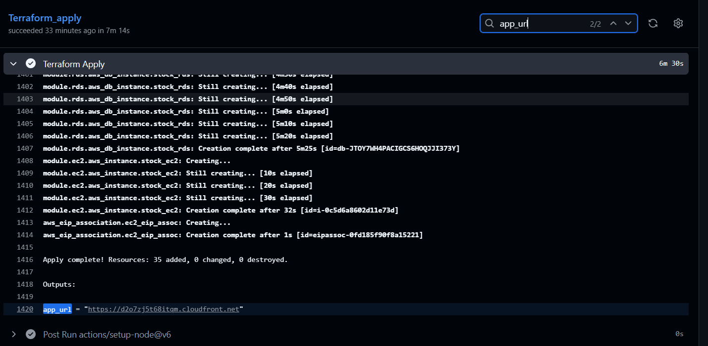
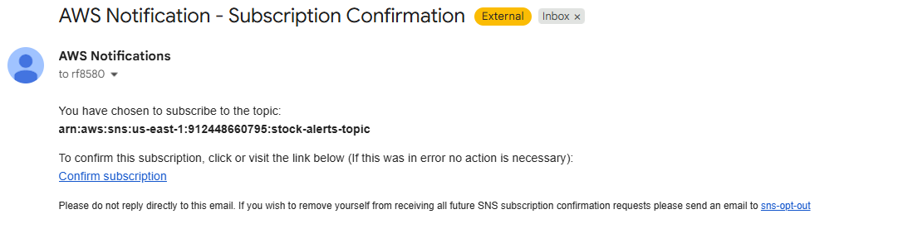
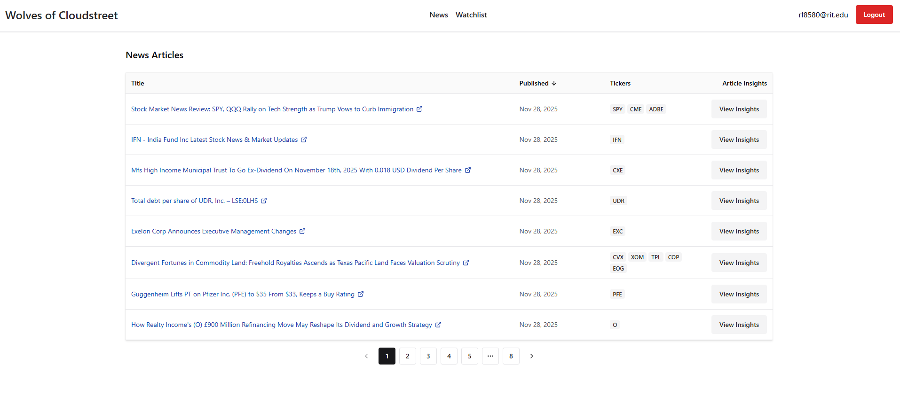
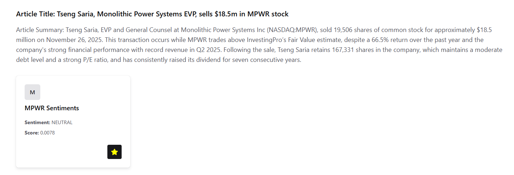
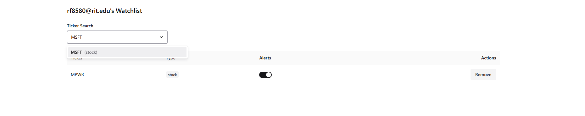
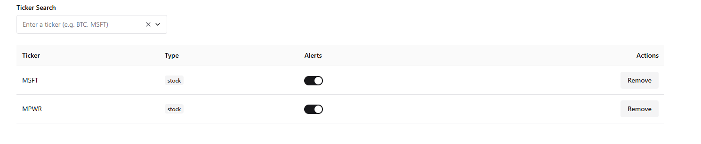

# How to run the Project from GitHub Actions
To begin, make sure you go update your GitHub repository settings to include the necessary secrets for authentication and configuration.
1. **Set Up GitHub Secrets**:
   - Navigate to the GitHub repository.
   - Go to `Settings` > `Secrets and variables` > `Actions`.
   - Click on `New repository secret` and add the following
   - ALPHA_VANTAGE_API_KEY: Your Alpha Vantage API key.
   - AWS_ACCESS_KEY_ID: Your AWS access key ID.
   - AWS_SECRET_ACCESS_KEY: Your AWS secret access key.
   - DB_NAME: name of database (stockpredictor) 
   - DB_USERNAME: database username (stockpredictor
   - DB_PASSWORD: database password
   - AWS_KEY_NAME: Your AWS key pair name.
   - Make sure to save each secret after adding it.
2. **Configure GitHub Actions Environment Variables**:
    - Navigate to the GitHub repository.
    - Go to `Settings` > `Secrets and Variables` > `Actions`.
    - At the top you will see a toggle for Secrets and Variables, click on `Variables`.
    - If not already added, add a n ew repository variable for AWS_REGION with the value of your desired AWS region (e.g., us-east-1).
    - Make sure it gets saved
3. **CRUCIAL: Set the terraform remote state bucket within main.tf**
    - In the [main.tf](https://github.com/514Team1Fall/StockPrediction-Team1-Fall2025/blob/main/terraform/main.tf) file of your repository, locate the `backend "s3"` block.
    - Update the `bucket` attribute to specify the name of your S3 bucket that will be used for storing the Terraform state.
    - Ensure that the S3 bucket exists in your AWS account and has proper permissions set up to allow Terraform to access it.
4. **Deploying The Project**:
    - Once the secrets and variables are set up, navigate to the `Actions` tab in your GitHub repository.
    - Select the workflow `Stock Prediction Deploy Script`.
    - Click Run workflow.
    - Select terraform_apply
    - Click the green `Run workflow` button to start the deployment process.
    - Monitor the workflow run to ensure it completes successfully.
    - The terraform state will be remotely managed in the S3 bucket specified in the previous step.
5. **Post-Deployment**:
    - After the workflow completes, you will get an output with the url to the cloudfront distribution.
    - Use this URL to access the deployed application, however, after initial deployment, it takes a few minutes for the API to be fully functional 
    - You will likely run into a 504 accessing the login page, but wait a few minutes and try again (IT WILL REMEDY).
6. **Teardown**:
    - To tear down the deployed infrastructure, you can run the `terraform_destroy` workflow in the same manner as the deployment workflow.
    - This will remove all resources created during the deployment process.

# How to use the project
## General notes about the project and its functionality
- There is a lambda function that gets deployed to fetch new articles and sentiments from Alpha Vantage.
- This lambda will run every 5 minutes (for demo and testing purposes) to update the information. When the project is deployed, there is some initial filler data that you can interact with while you wait, but know that it may take some time for new articles to populate.

## Initial Sign Up
1. Navigate to the deployed URL of the application (app_url from terraform_apply workflow).

1. Click on Log in / Sign Up 
2. Wait for the 504 Error to disappear when clicking the login / sign-up (if app was just deployed)
3. Sign up for an account
2. Verify your account through email 
3. **Don't Skip** Accept the subscription agreement for emails from the app. It may show up in your spam folder. The email will look like this:
  
4. Once you have verified your account and confirm the email subscription, you can log in and start using the app!
5. If you skipped step 3, you will not be able to add items to your watchlist.

## Viewing News Articles
1. Log in to your account
2. Once logged in you will be defaulted to the News page, which contains a paginated list of the articles collected.
3. You can click on an article name to view the article itself.


## Adding Stocks to Watchlists
Path A (Viewing Insights from News Page):
1. Log in to your account
2. Navigate to the News Page
3. Click "View Insights" on any article that lists tickers relevant to the article (Some articles can have any tickers listed).
4. Once within that menu you will see a list of tickers that are relevant to the article, along with the summary and sentiment of the tickers within the article.
5. You can click on the star icon next to any ticker to add it to your watchlist, the star will turn yellow to indicate it has been added.

Path B (Watchlist Page):
1. Log in to your account
2. Navigate to the Watchlist Page
3. You will see a list of all the current tickers you have added to your watchlist, along with the ability to toggle notifications for each ticker.
4. To add a ticker to your watchlist, click within the Ticker Search box, and type in a stock ticker you would like to track.
5. If the ticker is in the system, it will show up in a dropdown menu, and you can click on it to add it to your watchlist.
6. Note: not every ticker will be in the system, though a vast majority of very common tickers are, tickers are added as they are found from news scraping from Alpha Vantage.
View of searching a ticker:

View of ticker added to watchlist:


## Removing Stocks from Watchlists
1. Log in to your account
2. Navigate to the Watchlist Page
3. Click the remove button next to any ticker you would like to remove from your watchlist.

## How to test negative sentiments (Dev / Test Purpose):
1. Log in and add a ticker to your watchlist, and ensure notifications are enabled for that ticker.
2. Use your choice of Postman-like software to send a new article with negative function to the API.
2. Make a POST request to https://{deployedUrl}.cloudfront.net/api/articles/bulk with the following body (ensure Content-Type is application/json):
```json
// Example using MSFT (Microsoft) as the ticker
{
  "articles": [
    {
      "articleId": "BAD_ARTICLE2",
      "url": "https://example.com/article2",
      "title": "Article 1: MSFT Is BAD!",
      "summary": "MSFT did BAD",
      "publishedAt": "2025-11-19T18:00:00.000Z"
    }
  ],
  "sentiments": [
    {
      "articleId": "BAD_ARTICLE2",
      "tickerSymbol": "MSFT",
      "tickerSentimentScore": -0.5,
      "tickerSentimentLabel": "Negative",
      "relevanceScore": 0.8
    }
  ]
}

```
You will receive a 200 with response body of:
```json
{
  "message": "Bulk operation completed successfully"
}
```

3. Shortly after you will receive an email notification about the negative news looking like this:


# Done!
Thank you for running through the project! This readme covers the basics for using the application!
